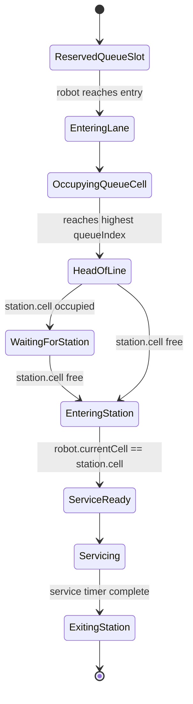
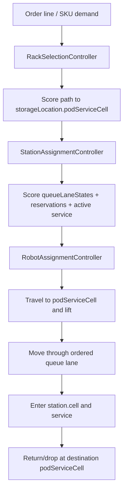

# Multi-Robot Queue and Storage Fixes

Date: 2026-05-14

## Root Cause: Only One Robot Ran

The simulator still had a legacy station gate:

- if a station already had an assigned or in-progress task, all later tasks for that station were skipped
- this made the station behave like a single global lock
- queue lanes existed in the data model, but dispatch did not reserve their capacity

This was wrong RMFS behavior. A station may service one robot at a time, but its queue lane may hold additional robots. Dispatch should be blocked by lane capacity, robot/rack availability, and traffic reservations, not by "one active station task".

## Runtime Queue Lane Model

`SimulationState` now includes:

- `queueLaneStates`
- `occupiedCells`
- `reservedRobotIds`
- `reservedTaskIds`
- `activeHeadRobotId`

Dispatch now:

1. selects a compatible station
2. selects a queue lane with remaining capacity
3. selects an idle robot
4. plans through the reserved queue lane
5. reserves the lane slot
6. assigns the task

Station service remains one-at-a-time unless station capacity is increased. Queue capacity is separate from station service capacity.

## Root Cause: Rack Snapped Back After Reallocation

The design canvas rack layer always rendered racks from `layout.racks[].homeCell`. During simulation, that is not the source of truth.

Runtime source of truth:

- `rackStates[rackId].currentCell`
- `rackStates[rackId].currentStorageLocationId`
- `storageLocationStates[storageId].currentlyStoredRackId`

After nearest-available storage reallocation, the layout home cell should remain unchanged unless an explicit policy says to update home.

## Runtime Rack Rendering

Simulation Mode now uses `RuntimeRackLayer`.

Rules:

- carried racks are hidden from the stored-rack layer because `RobotLayer` renders the carried rack
- stored/reserved racks render from runtime storage/cell state
- relocated racks render at the destination `podServiceCell`
- design-time `ObjectLayer` still renders rack homes in Design Mode

The helper `getRackRuntimeRenderState()` is pure and unit-tested.

## Storage Reallocation Fix

`nearest_available_storage` now:

- excludes the source storage location while the rack is being moved
- considers only empty/unreserved compatible storage locations
- scores by route distance to `podServiceCell`
- reserves the selected destination before dispatch
- updates rack runtime storage and cell on drop

`return_home` now verifies that home is compatible and available/reserved for that rack.

## Semantic Runtime Guards

Invariants now flag:

- station service when robot is not on `station.cell`
- lifting when robot is not on source `podServiceCell`
- dropping when robot is not on destination `podServiceCell`
- stored rack current cell not matching its storage `podServiceCell`
- queue lane over-capacity
- duplicate queue lane occupancy

## Verification

Commands run:

- `npm run build`: passed
- `npm test -- --run`: passed, 20 files / 101 tests after the queue-lane-first controller alignment tests were added
- `npm run test:e2e -- --workers=1`: passed, 19 tests

Focused tests added:

- multi-robot assignment no longer blocked by active station task
- queue lane reservations increase when multiple robots dispatch
- nearest-available storage selects a different empty destination when available
- runtime rack render position follows destination storage after drop
- deterministic scenario runner covers multi-robot queue dispatch and rack relocation

Live app smoke:

- Small Demo initialized
- 6 tasks generated
- one step produced 4 active robots and 4 assigned tasks
- queue lane reservations were visible
- no browser console errors were captured

## Remaining Limitations

- Queue lane motion is still backed by path reservations and runtime lane state, not a full station-lane traffic micro-simulator.
- Post-drop egress is not yet a distinct animation/state.
- This is still not WHCA*, CBS, or full MAPF.

## 2026-05-16 Queue-Head Station Collision Fix

A user diagnostics bundle showed a loaded robot repeatedly trying to enter `station.cell` while another robot was servicing there. Collision prevention logged warnings, but the rollback could preserve a partially interpolated pose, making the robot appear to overlap visually.

Fixes added:

- Loaded robots now hold at queue head when the station service cell is occupied.
- Collision rollback now recenters the rolled-back robot on its previous safe cell.
- Regression tests cover both behaviors.

## 2026-05-16 Queue-Lane-First Controller Alignment

The latest alignment pass made queue-lane runtime state the single source of truth for station queue decisions.

Fixes added:

- `StationQueue.waitingRobotIds` is derived from runtime state at the station-service seam instead of being a controller input.
- `shortest_queue` station assignment scores live queue-lane occupied cells, lane reservations, and active service occupancy.
- Rack selection by nearest SKU rack scores route cost to `StorageLocation.podServiceCell`.
- Generic shortest-path routing blocks station cells as incidental pass-through nodes.
- Debug / QA exposes queue-lane inspector, station admission trace, why-waiting trace, controller decision trace, and reservation snippets.

## 2026-05-16 Physical Queue Entry Admission Fix

The user diagnostics bundle showed the remaining failure clearly: two loaded robots were allowed to occupy the same queue-head cell while another robot was in the station service cell. The queue had become an abstract capacity counter rather than a physical lane.

Fixes added:

- Queue dispatch reserves only the physical entry/tail cell of a lane.
- Robots advance from queue cell to queue cell only when the next ordered cell is empty and unreserved.
- A robot at queue head enters `station.cell` only when station service occupancy is clear.
- Planned task generation now accounts for planned queue load before choosing stations.
- Station assignment filters out compatible stations that are not reachable from the rack `podServiceCell`.
- Runtime collision detection now includes the robot visual pose cell, not only the last completed `currentCell`.
- The active simulation store adopts the layout-specific simulation config during Initialize, so Small Demo uses its shortest-queue and demo-speed settings when generating tasks.
- The default Small Demo follows the current user-tested custom layout shape with two external pick stations.

Updated verification:

- `npm run typecheck`: passed.
- `npm test -- --run`: passed, 20 files / 105 tests.
- `npm run build`: passed.
- `npm run test:e2e -- --workers=1`: passed, 19 tests.

Known limitation:

- This is still local queue admission and reservation control, not WHCA*, CBS, or full MAPF. Robots may wait conservatively instead of globally replanning through alternate aisles.

## Next Recommended Engineering Step

Add a WHCA-style rolling-horizon planner only after more user testing confirms the corrected station/queue/pod/storage semantics remain stable.
